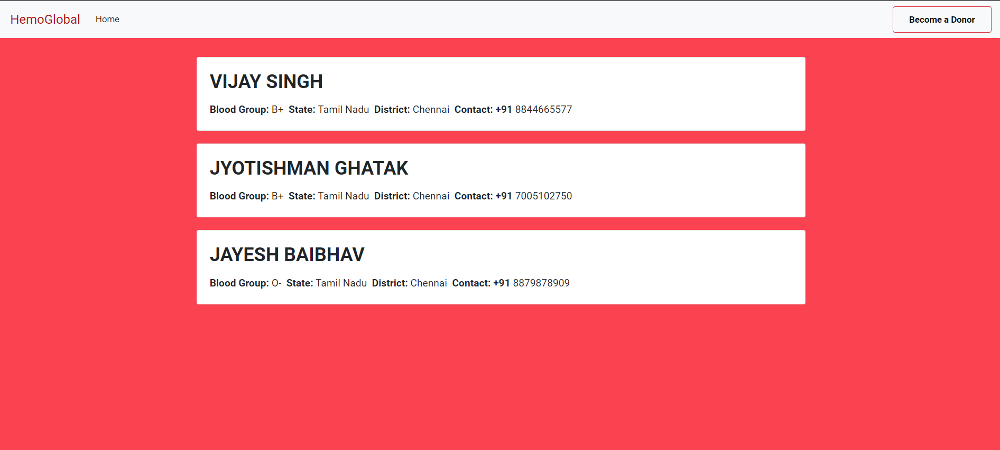
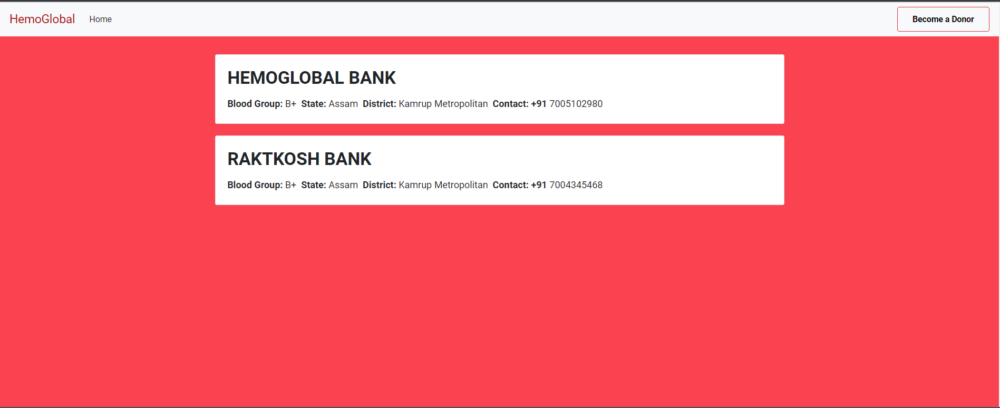
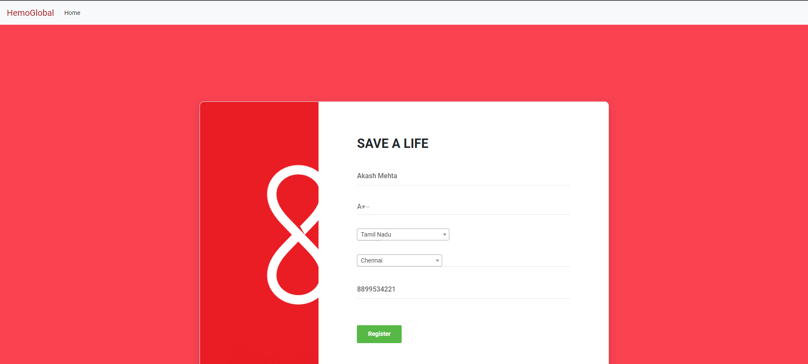
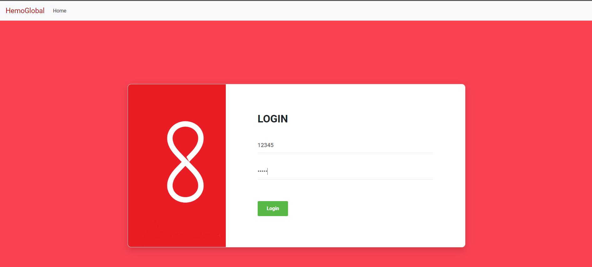
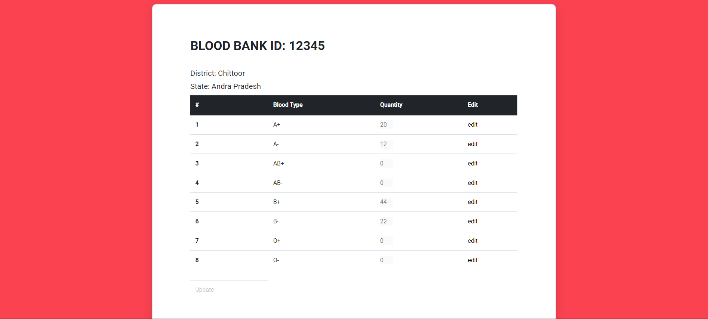

# HemoGlobal: Blood Bank Management Service
HemoGlobal is a web-based blood bank service management application that provides users to get easy access to blood requirements. 


## Getting started
To get the Node app running locally:
- Clone this repo
- `npm install` to install all required dependencies
### Start Up the Application
**Enter the following command in the terminal.** 
```
node index.js 
```
## Code Overview
### Dependencies
- **expressJs:** To build web server.
- **passportJs:** To enable authentication and session management.
- **bcryptJs:** To hash passwords.
- **ejs:** Used as a templating engine.
- **mongoose:** To handle mongoDB queries.


### Application Structure
- **index.js:** Entry point of the application. It creates the web server and handels all the and middlewares and importing of libraries.
- **userRoutes.js:** It handles all the routes and call thier respective controller functions.
- **userController.js:** It contains the definition of controller functions.
- **auth.js:** It takes care of the authentication using sessions.
- **db.js:** Connects and configure the database.
- **views:** Contains all the ejs file to serve the frontend
- **public:** Contains styling and client side scripting.


## Screen Shots

#### HomePage

#### Donor List

#### Blood Bank List

#### Donor Registration

#### Blood Bank Login

#### Blood Bank Inventory Management



